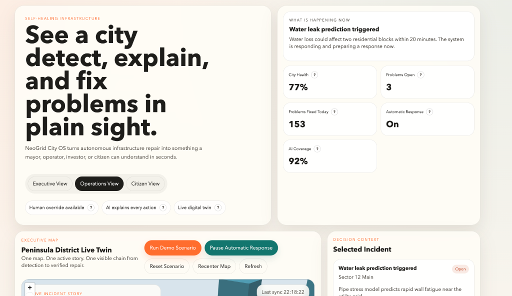
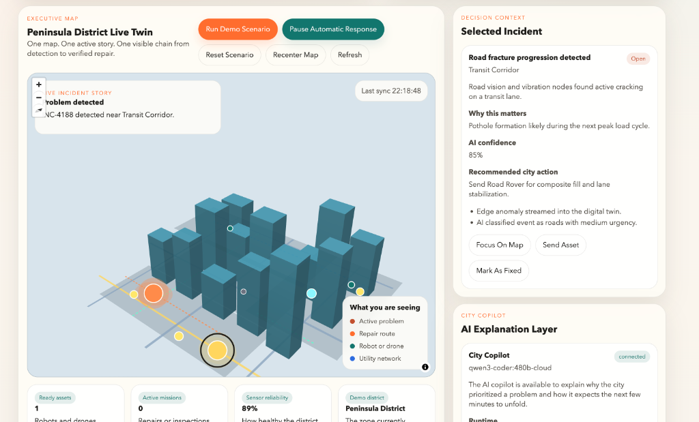
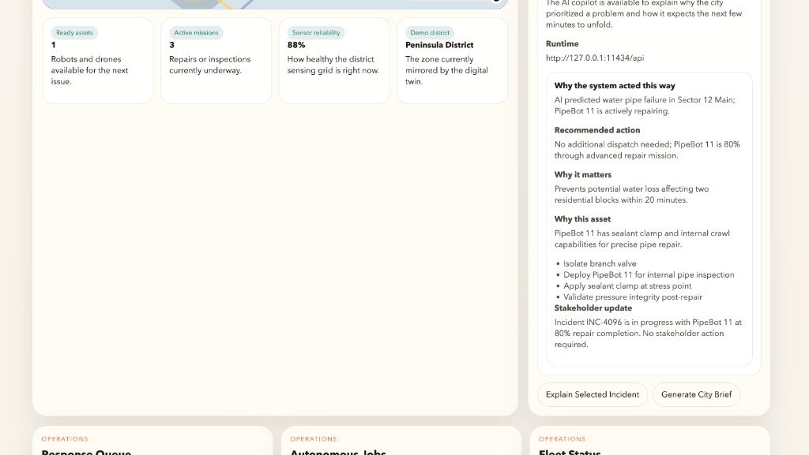
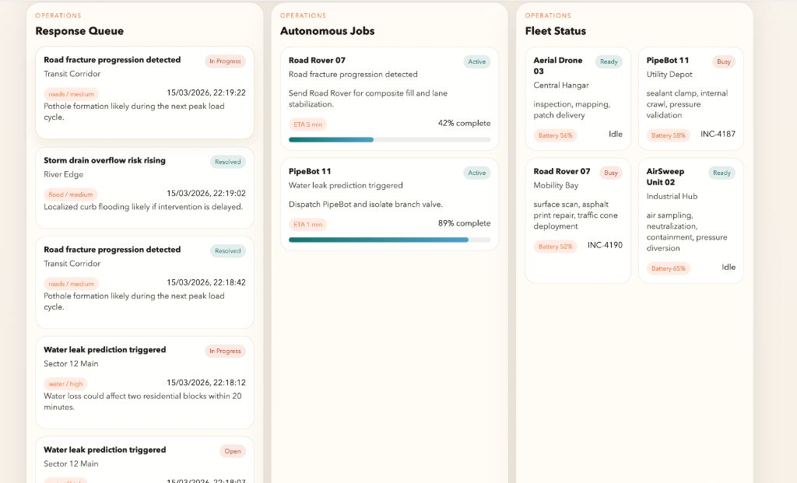
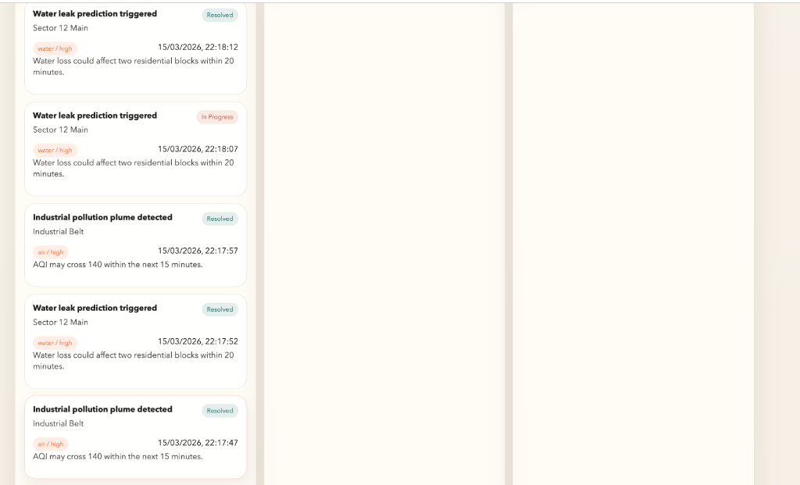

<div align="center">

# 🏙️ CityGuardAI

### Autonomous Self-Healing Smart City Operations Dashboard

**See a city detect, explain, and fix infrastructure problems — in plain sight.**

[](https://nodejs.org/)
[](https://maplibre.org/)
[](https://ollama.com/)
[](LICENSE)

<br/>

*A dependency-free, full-stack prototype that simulates a futuristic city district where sensors detect problems, AI explains them, and autonomous robots fix them — all visible on a live digital twin.*

</div>

---

## 📸 Demo

### Hero Dashboard — Executive View
> The landing experience: real-time city health score, open problems, automatic response status, and a live story card summarizing the most critical action happening right now.



---

### Live Digital Twin — Interactive 3D Map
> A MapLibre GL–powered isometric map of the Peninsula District. Active incidents pulse in real-time, repair routes trace across the grid, and autonomous assets (drones & ground robots) move toward problems.



---

### AI Copilot — Explainability Layer
> The AI Copilot (powered by Ollama) breaks down *why* the system acted the way it did. It explains the recommended action, why a specific asset was chosen, step-by-step repair instructions, and a stakeholder-ready update — all generated from live operational context.



---

### Operations View — Response Queue, Autonomous Jobs & Fleet
> The operator's command center: a real-time incident queue with severity tags, active autonomous repair missions with progress bars, and a fleet status grid showing every robot and drone's battery, capabilities, and current assignment.



---

### Incident History & Resolution Feed
> Full incident lifecycle tracking — from detection to resolution. Every event is timestamped, categorized, and color-coded by severity and status (Open → In Progress → Resolved).



---

## ✨ Features

### 🧠 AI-Powered Intelligence
| Feature | Description |
|---------|-------------|
| **AI Copilot** | Ollama-powered natural language explanations for every incident — why it matters, what to do, and what happens next |
| **Incident Analysis** | Structured JSON briefings with confidence scores, repair steps, and stakeholder updates |
| **City Briefings** | Executive-level summaries of city posture, top risks, and recommended next actions |
| **Explainability** | Every autonomous decision is traceable and explainable in plain English |

### 🗺️ Live Digital Twin
| Feature | Description |
|---------|-------------|
| **3D Isometric Map** | MapLibre GL renders buildings, roads, pipes, zones, and depots as a living city model |
| **Real-Time Incidents** | Pulsing markers with severity-coded halos show active problems |
| **Repair Routes** | Animated route lines show drone flight paths and ground robot navigation |
| **Asset Tracking** | Live positions of all autonomous assets on the map |

### 🤖 Autonomous Response Engine
| Feature | Description |
|---------|-------------|
| **Auto-Dispatch** | AI matches the best available robot/drone to each incident based on capabilities |
| **Mission Lifecycle** | Full cycle: detection → dispatch → in-progress → repair → verification → resolved |
| **Fleet Management** | Battery monitoring, charging cycles, and capability-based assignment |
| **Sensor Network** | Health-tracked sensors across water, roads, air quality, and flood categories |

### 🎛️ Multi-View Dashboard
| View | Audience | Shows |
|------|----------|-------|
| **Executive** | Mayors, investors | City health, KPIs, live story, proof timeline |
| **Operations** | City operators | Incident queue, missions, fleet, and scenario builder |
| **Citizen** | Public | Plain-language notices about what's happening in their neighborhood |

---

## 🏗️ Architecture

```
┌─────────────────────────────────────────────────────────┐
│                    Browser (Frontend)                    │
│  ┌──────────┐  ┌───────────┐  ┌───────────────────────┐ │
│  │ app.js   │  │ styles.css│  │ MapLibre GL (vendor)  │ │
│  │ SSE ←────│──│───────────│──│── Map Rendering       │ │
│  │ UI Logic │  │ Dark Theme│  │   3D Buildings        │ │
│  └────┬─────┘  └───────────┘  │   Route Animation     │ │
│       │                       └───────────────────────┘ │
└───────│─────────────────────────────────────────────────┘
        │ HTTP + SSE
┌───────▼─────────────────────────────────────────────────┐
│                    server.js (Backend)                   │
│  ┌──────────────┐  ┌─────────────┐  ┌────────────────┐ │
│  │ Incident     │  │ Mission     │  │ city-layout.js │ │
│  │ Engine       │  │ Lifecycle   │  │ GeoJSON Gen    │ │
│  ├──────────────┤  ├─────────────┤  ├────────────────┤ │
│  │ Auto-Dispatch│  │ Fleet Mgmt  │  │ Route Planning │ │
│  ├──────────────┤  ├─────────────┤  ├────────────────┤ │
│  │ Sensor Sim   │  │ SSE Stream  │  │ Map Payload    │ │
│  └──────┬───────┘  └─────────────┘  └────────────────┘ │
│         │                                               │
│  ┌──────▼───────┐  ┌─────────────────────────────────┐ │
│  │ data/        │  │ Ollama AI Integration            │ │
│  │ store.json   │  │ Incident Analysis + City Briefs  │ │
│  │ seed.json    │  │ Structured JSON Output           │ │
│  └──────────────┘  └─────────────────────────────────┘ │
└─────────────────────────────────────────────────────────┘
```

---

## 🚀 Getting Started

### Prerequisites

- [Node.js](https://nodejs.org/) v18 or higher
- [Ollama](https://ollama.com/) (optional — for AI Copilot features)

### Installation

```bash
# Clone the repository
git clone https://github.com/TechTonicShift/CityGuardAI.git
cd CityGuardAI

# Start the server (zero dependencies — no npm install needed!)
npm start
```

The dashboard will be available at **http://localhost:3000**

### Enable AI Copilot (Optional)

```bash
# Install and start Ollama
ollama serve

# Pull the recommended model
ollama pull qwen3-coder:480b-cloud

# The server auto-connects to Ollama at http://127.0.0.1:11434/api
```

For cloud-hosted Ollama endpoints:

```bash
OLLAMA_BASE_URL=https://your-ollama-endpoint.com/api \
OLLAMA_API_KEY=your-api-key \
npm start
```

### Reset Demo Data

```bash
npm run reset
```

---

## 🎮 How to Use

### 1. **Run a Demo Scenario**
Click the **"Run Demo Scenario"** button to inject a random infrastructure incident (water leak, road fracture, air pollution, or flood risk). The system will:
- Detect the anomaly via the sensor network
- Classify severity and category using AI
- Display it on the digital twin map
- Auto-dispatch the best-matched robot or drone (if automatic response is ON)

### 2. **Explore Views**
Switch between **Executive**, **Operations**, and **Citizen** views using the mode tabs at the top.

### 3. **Interact with Incidents**
Click any incident marker on the map or in the queue to see:
- Full incident details and AI assessment
- Confidence score and predicted impact
- Worklog with timestamped actions

### 4. **Use the AI Copilot**
- **"Explain Selected Incident"** — Get a detailed AI breakdown of why the system chose a specific response
- **"Generate City Brief"** — Get an executive-level summary of the entire city's current state

### 5. **Build Custom Scenarios**
In Operations View, use the **Scenario Builder** form to create custom incidents with specific categories, severities, and descriptions.

---

## 📁 Project Structure

```
CityGuardAI/
├── index.html          # Dashboard UI — hero, map, sidebars, operations panels
├── styles.css          # Full stylesheet — dark theme, responsive, view modes
├── app.js              # Frontend logic — map rendering, SSE, AI copilot, UI state
├── server.js           # Backend — HTTP server, incident engine, missions, AI integration
├── city-layout.js      # GeoJSON generator — buildings, roads, pipes, zones, routes
├── reset-data.js       # Utility to reset store.json back to seed state
├── package.json        # Project manifest (zero external dependencies)
├── data/
│   ├── seed.json       # Initial city state — sensors, assets, incidents
│   └── store.json      # Runtime state (auto-managed by server)
├── vendor/
│   ├── maplibre-gl.js  # MapLibre GL JS (vendored for zero-dependency setup)
│   └── maplibre-gl.css # MapLibre GL styles
└── screenshots/        # Demo screenshots for documentation
```

---

## 🔧 Technical Highlights

| Aspect | Detail |
|--------|--------|
| **Zero Dependencies** | No `npm install` required — the entire stack runs on Node.js built-ins + vendored MapLibre |
| **Server-Sent Events** | Real-time streaming updates from server to all connected clients |
| **GeoJSON Pipeline** | Procedurally generated city geometry — buildings, roads, pipes, zones — all in code |
| **Structured AI Output** | Ollama generates JSON responses conforming to strict schemas for reliable parsing |
| **Simulation Engine** | Tick-based simulation with battery drain, sensor health recovery, and mission progression |
| **Multi-View Architecture** | Single HTML page serves three distinct experiences via CSS data attributes |
| **Stateful Persistence** | All city state is saved to `store.json` and survives server restarts |

---

## 🌐 API Endpoints

| Method | Endpoint | Description |
|--------|----------|-------------|
| `GET` | `/` | Serve the dashboard |
| `GET` | `/api/overview` | Full city state snapshot |
| `GET` | `/api/stream` | SSE stream for real-time updates |
| `POST` | `/api/incident` | Create a new incident |
| `POST` | `/api/simulate` | Run a random demo scenario |
| `POST` | `/api/dispatch/:id` | Dispatch an asset to an incident |
| `POST` | `/api/resolve/:id` | Mark an incident as resolved |
| `POST` | `/api/mode` | Toggle auto-heal mode |
| `GET` | `/api/ai/status` | Check Ollama AI availability |
| `GET` | `/api/ai/incident/:id` | AI analysis of a specific incident |
| `GET` | `/api/ai/brief` | AI-generated city briefing |
| `POST` | `/api/reset` | Reset to seed state |

---

## 🧪 Demo Scenario Types

| Scenario | Category | Example |
|----------|----------|---------|
| 💧 **Water Leak Prediction** | `water` | Pipe stress model predicts rapid wall fatigue near the utility grid |
| 🛣️ **Road Fracture Progression** | `roads` | Road vision and vibration nodes found active cracking on a transit lane |
| 🏭 **Industrial Pollution Plume** | `air` | Stack emissions exceeded neighborhood air baseline in the industrial belt |
| 🌊 **Storm Drain Overflow Risk** | `flood` | Drain sonar reports a rapid flow spike near the river edge retention basin |

---

## 🤖 Autonomous Fleet

| Asset | Type | Capabilities |
|-------|------|-------------|
| **PipeBot 11** | Ground Robot | Sealant clamp, internal crawl, pressure validation |
| **Road Rover 07** | Ground Robot | Surface scan, asphalt print repair, traffic cone deployment |
| **Aerial Drone 03** | Drone | Inspection, mapping, patch delivery |
| **AirSweep Unit 02** | Ground Robot | Air sampling, neutralization, containment, pressure diversion |

---

## 📄 License

This project is licensed under the MIT License.

---

<div align="center">

**Built with 🧠 AI + 🗺️ Maps + 🤖 Autonomous Systems**

*CityGuardAI — Where infrastructure heals itself.*

</div>
